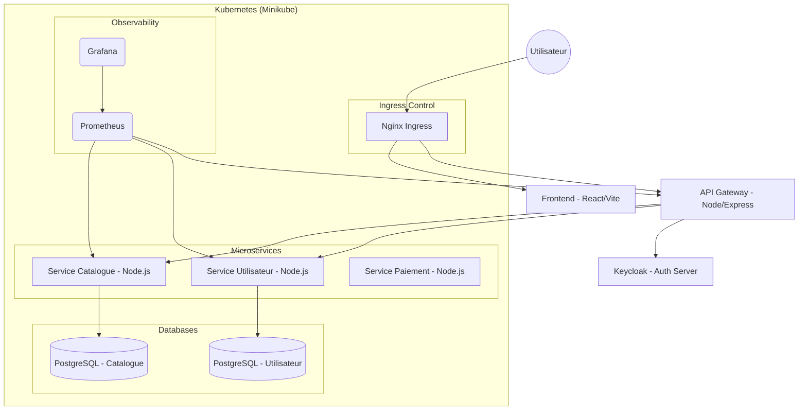

# Architecture Technique - Collector.shop

## Schéma d'Architecture (Mermaid)

## Choix Techniques
- **Frameworks** : Node.js (Backend), React/Vite (Frontend).
- **Protocoles** : REST (HTTP/JSON).
- **Microservices** : Architecture découplée pour la scalabilité et la résilience.
- **Sécurité** : Gateway avec `helmet` et `rate-limit`, Authentification via JWT/Keycloak.
- **Base de données** : PostgreSQL (une instance par service pour l'isolation).
- **Orchestration** : Kubernetes (Minikube) pour la portabilité cloud-native.
- **Pipelines** : GitHub Actions (CI/CD) avec Trivy (Sécurité) et Jest (Tests).
- **Observability** : Prometheus/Grafana pour le monitoring des métriques.
